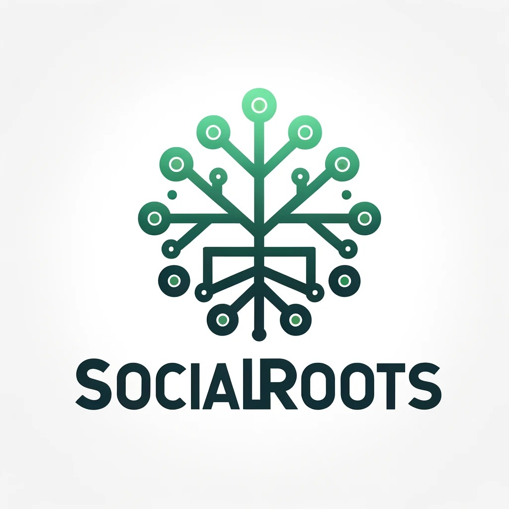
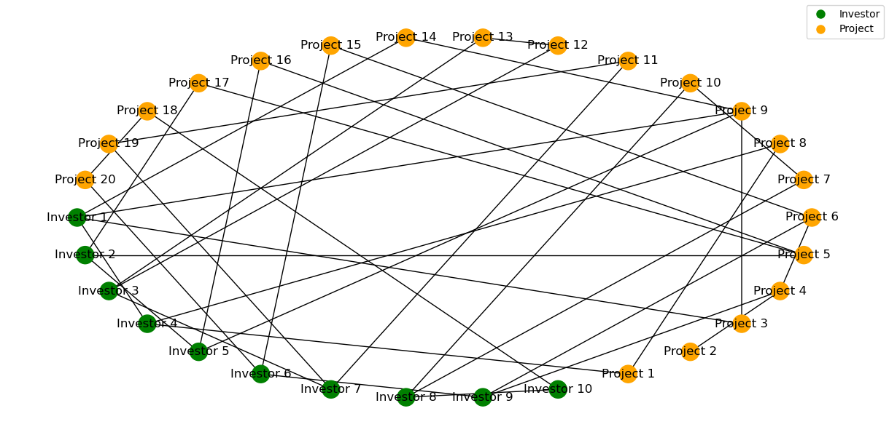

    Our project aims to develop a platform for sustainability projects and investors, leveraging graph-based analysis and machine learning algorithms to predict and facilitate connections between investors and projects.

Tech Stack:
Pitch Deck link
Stackup account username

## Table of Contents

1. [Overview](#overview)
    - [Project Description](#project-description)

1. [Graph-infused Machine Learning Pipeline](#graph-infused-machine-learning-pipeline)
2. [Images](#images)

## Overview

### Project Description

Our project aims to revolutionize the landscape of sustainability initiatives by developing a sophisticated recommender system that connects investors with impactful projects, fostering collaboration and innovation in addressing pressing global challenges. With a user-centric approach, our platform caters to both investors seeking opportunities for meaningful investment and project owners looking to secure funding and support for their initiatives.

For investors, our platform offers a streamlined experience for discovering and evaluating investment opportunities aligned with their interests and values. Leveraging a diverse array of parameters such as investment scale, area of expertise, risk appetite, and geographic region, investors can fine-tune their investment preferences and explore projects spanning various domains, from environmental conservation and community development to technological innovation and public health initiatives. The platform also facilitates networking among investors, allowing them to collaborate and pool resources for collective impact.

On the project side, our platform provides project owners with essential tools and resources to effectively manage their initiatives and attract investment. Whether serving as the project owner responsible for overseeing the entire endeavor or volunteering to contribute expertise and support, users can leverage the platform to showcase their projects, connect with potential investors, and explore opportunities for collaboration with other projects. Additionally, project owners benefit from tailored guidance and support to navigate the complexities of project management and maximize their impact.

Central to our platform is a sophisticated matchmaking algorithm powered by machine learning techniques applied to graph analysis. By analyzing the interconnectedness of investors, projects, and their attributes, our algorithm identifies compatible matches and predicts the likelihood of successful collaborations. This approach enables efficient and effective matchmaking, facilitating mutually beneficial partnerships between investors and projects and driving positive social and environmental change on a global scale.

## Graph-infused Machine Learning Pipeline
Our machine learning pipeline is designed to harness the power of graph analysis to enhance the efficiency and effectiveness of predictive modeling in a variety of applications. Here's a breakdown of each step in our pipeline:

1. **Data Modeling**: We start by modeling our data as a graph, where entities such as investors and projects are represented as nodes, and relationships such as investments or collaborations are represented as edges. This graph structure allows us to capture the complex interdependencies and interactions between different entities in our dataset.

2. **Graph Characteristics**: Once our data is represented as a graph, we leverage various graph characteristics and features to enrich our predictive models. These characteristics may include node degree, centrality measures, and graph embeddings, which provide valuable insights into the underlying structure of our data and help improve the performance of our machine learning algorithms.

3. **Training**: With our graph data prepared, we train machine learning models to predict various outcomes of interest, such as the likelihood of an investor investing in a particular project or the probability of a collaboration between two entities. We employ a variety of supervised learning techniques, such as logistic regression, to learn from the graph data and make accurate predictions.

4. **New Node Prediction**: One of the key capabilities of our pipeline is the ability to predict relationships involving new nodes that are not present in the original dataset. By leveraging the graph structure and learned relationships, we can infer potential connections between new investors and projects, enabling proactive matchmaking and facilitating future collaborations.

5. **Ranking System**: In addition to predicting relationships, our pipeline incorporates a ranking system to prioritize potential connections based on their likelihood of success or relevance. This ranking system considers various factors, such as the strength of existing relationships, the compatibility of attributes between entities, and the historical performance of similar connections, to provide personalized recommendations tailored to the specific needs and preferences of users.

6. **Insights Obtained**: Finally, our pipeline generates valuable insights into the underlying dynamics of the ecosystem, revealing patterns, trends, and relationships that may not be immediately apparent from the raw data. These insights can inform strategic decision-making, guide resource allocation, and drive innovation in sustainability initiatives, ultimately leading to more impactful and sustainable outcomes.

## Images
